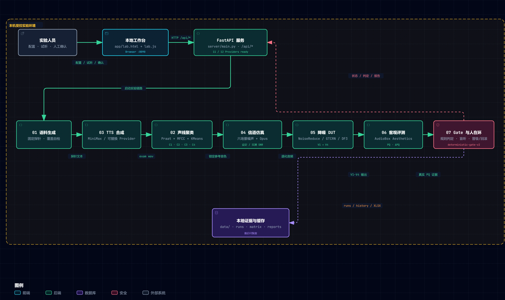

# 通话评测实验室

把通话算法验证做成可交互、可观察、可追溯的本地受控实验：固定参考音色、探针语料、
噪声环境与评测规则，只改变 DUT 算法版本。核心路径可在普通 CPU 电脑运行；不同 Provider
仍可能有各自的内存、模型权重和 API 要求。

> 目标：让没有重资产实验室条件的人也能理解并扩展一套通话音频实验 workflow。



架构封面与 WebM 是预录流程示意；图中就绪数量是录制时的示例，不代表你的机器状态。启动后可在总览展开动效或打开交互架构。

## 产品心智模型

```
固定测试矩阵 Golden Benchmark v1
                 ↓
当前基准版本 → 待验证版本 → 固定矩阵评测 → 人工确认晋级 / 回滚
     ↑                                           │
     └──────────────── 下一轮比较 ───────────────┘
```

Loop 是产品的外层结构；语料、声线、TTS、信道、降噪和评测是 Loop 内部调用的六项能力，
也可在专业工作台独立使用。确定性工程 Gate 先限定可执行动作；LLM 只提供归因和建议，
不能绕过 Gate；最终仍由人在环确认。

- **Golden Benchmark** 回答“用什么尺子测？”
- **当前基准版本（Baseline）** 回答“新版本和谁比？”
- **待验证版本（Candidate）** 是本轮准备验证的新算法。
- 新工作区不会凭空指定基准版本；用户首次建立，或由上一轮确认晋级产生。

## 当前状态

| 模块 | 状态 | 说明 |
|---|---|---|
| 01 语料生成 | ready | 中文通话语料 + 易混音对覆盖自检 |
| 02 音色聚类 | wip | 声线特征 + KMeans 聚类 + 覆盖矩阵 |
| 03 TTS 合成 | wip | MiniMax 系统音色合成 exam wav（预留本地引擎插槽） |
| 04 信道仿真 | wip | Opus 编解码闭环 × 多噪声场景，记录设定/实测 SNR 与码率 |
| 05 降噪 DUT | wip | GTCRN / DeepFilterNet3 / noisereduce |
| 06 评测 | wip | AudioBox PQ/PC/CE/CU + ΔPQ；综合分与等级默认关闭 |
| 外层版本验证 Loop | wip | 当前版本 → 新版本 → Gate/LLM 建议 → 盲听 → 人在环留痕 |

> ready = 达到当前验收标准；wip = 有可跑的最小闭环，仍在打磨验收。

## 最新进展

- **声学向量空间**：缓存的 21 维声学特征投影到三维，支持旋转、簇聚焦和点选试听；三轴统一比例，解释方差不等于聚类准确率。切换簇聚焦保留正在试听的播放器。
- **可展开的运行架构**：总览先给简洁预览，展开后播放；可暂停、重播，也可打开交互架构查看关系。流程演示与实时任务状态分开。
- **报告与缺测**：网页保留摘要，Excel 导出轮次和逐样本证据。场景比较使用双方有效的同一批配对样本，缺测不当作 0；环境声级是参考标签，实际混音以 SNR 为准。

- **05 接入 noisereduce**：`prop_decrease` 是该 Provider 的原生降噪强度旋钮。GTCRN / DeepFilterNet3 的 `strength` 仍是湿/干混合演示参数，Trace 以 `strength_mode=wet_dry_demo` 明确标注，不能当作模型原生强度。
- **可恢复 Run**：评测与簇级回归按 `run_id` 写入 `data/runs/`，服务重启后仍能恢复最近结果。
- **版本化 Trace**：降噪与信道使用 schema v3，人工盲听使用独立的版本化 schema；旧 CSV 保留取证但停止追加。
- **锁定设计系统**：暖纸墨黑的 editorial workbench，唯一依据见 `design.md` 与 `tokens.css`。

## 目录结构

| 目录 | 用途 |
|---|---|
| `app/` | 前端工作台（HTML，总览 + 各模块下钻） |
| `server/` | 本地后端（FastAPI，把 modules 挂成 HTTP 接口） |
| `modules/` | 七个模块，编号是模块标识；实际依赖顺序见下方流程，各自可独立运行 |
| `data/` | 数据资产，数字唯一来源（红线见 `data/README.md`） |
| `models/` | 模型权重下载指引（权重不入仓库） |
| `docs/` | ADR / 设计 token / 口径依据 |
| `tests/` | 模块验收测试 |

## 第一次准备与后续迭代

1. **首次准备**：语料（01）→ TTS 音频（03）→ 提取声学特征、聚类并锁定参考集（02）。先有真实音频才能分析声线，因此目录编号不代表执行先后。
2. **准备噪声和模型**：按准备指南补齐六场景噪声、降噪模型及 AudioBox，在“配置与运行”检查就绪项。
3. **后续比较**：复用已锁定的语料、音色和分组，经信道仿真 → 两版降噪 → 客观评测 → 人工复核；已有 TTS 缓存不会因每轮比较而重新生成。
4. **读结果**：总览查看结论和六场景图，进入场景查看证据；实验历史和报告用于复盘，全部样本可下载 Excel 筛选。

## 快速开始

通话评测实验室不是一个可以直接双击 HTML 使用的静态网页：浏览器页面依赖本机 Python 服务。
第一次下载后先安装依赖；以后每次重启 Windows，只需重新启动一次服务。

```powershell
# 获取源码
git clone https://github.com/FynnBlip/signal-desk.git
cd signal-desk

# Windows PowerShell，项目根目录
& "C:\Program Files\Python312\python.exe" -m pip install -r requirements.txt

# 可选：生成不含真实语音的 wiring smoke fixtures
& "C:\Program Files\Python312\python.exe" scripts/bootstrap_demo.py

# 启动服务；健康检查通过后打开 http://127.0.0.1:8090
& "C:\Program Files\Python312\python.exe" server/main.py
```

安装依赖后，Windows 用户推荐直接双击 `启动.bat`。它会寻找 Python、启动本地服务、等待
`/api/health` 真正就绪，再自动打开浏览器。关闭浏览器不会删除缓存或实验历史；关闭 Python
服务窗口、注销或重启 Windows 后，需要再次双击 `启动.bat`。如果页面显示 `Failed to fetch`，
表示本地服务没有运行，重新启动服务并点击页面内的“重新连接/重新读取”即可。

首次启动或加载 AudioBox 等模型可能需要较长时间。`启动.bat` 等待 120 秒；若仍未通过健康检查，
请在 PowerShell 中直接运行上面的 `server/main.py` 命令查看完整错误。不要直接打开 `app/*.html`，
应始终访问启动脚本打开的 `http://127.0.0.1:8090/`。

复制 `.env.example` 为 `.env`，按需配置 MiniMax、AudioBox 或 DeepSeek。没有对应 key/权重时，
相关 Provider 会明确显示未就绪，其余槽位仍可独立使用。降噪 ONNX 权重与 AudioBox checkpoint
见 `models/README.md`，权重不入仓库。

### 第一次真实比较

服务启动不等于测试素材已准备好。打开工作台后，首页会列出参考音色、六场景噪声、降噪算法与 AudioBox 模型四项状态。可在浏览器打开 `/setup.html` 查看逐项操作指南。

- 固定基准使用 **26 个不同音色与 4 个簇**：在 TTS 合成页选择缓存，或“准备测试音色”→预览调用量→确认生成；再到声线页“四簇聚类”→“锁为声线参考集”。其它数量用于独立分析。声线资源锁定与降噪版本晋级分别管理。
- MiniMax 生成需要账号与额度，先预览调用量；目录不足 26 个音色时不启动固定基准生成。
- `bootstrap_demo.py` 仅检查布线；它的合成噪声不能用于正式版本比较，即使与正式素材混放也会被拦截。
- 四项就绪后再开始内置 V1 → V2，复核真实结果后人工确认。没有密钥或模型时可以浏览工具，但没有可直接运行的离线质量评测 Demo。

## 自验证

```bash
python -m unittest discover -s tests -v
python scripts/smoke_test.py  # 服务已启动时
```

`bootstrap_demo.py` 生成的是合成音与合成噪声，只用于检查布线，不是语音数据集、基准或质量证据。
人工体验验收可直接按 [`docs/验收清单.md`](docs/验收清单.md) 从首页走到闭环。

## 数据红线

- 所有评分必须来自真实模型推理；缺测明确为空，不用占位假数据。
- 一份数据一个唯一来源，`matrix/` 是源，降噪产物按 `denoised/<版本>/` 归位。
- 无解就写无解，不造晋级假象；历史 CSV 不改，新数据写新时间戳。
- PC 是 Production Complexity，不是质量轴；默认不与 PQ/CE/CU 平均成“综合质量”。
- 噪声场景中的 `level_db` 只是场景参考标签，不参与数字混音；真实注入强度由设定 SNR 与实测 SNR 记录。

## 开源边界

代码使用 MIT License。模型权重、第三方数据集和远程 API 分别遵守其原始许可与服务条款；
仓库不包含任何公司内部数据、参数、用例、标准或实验室文件。

## 发心

这不是为了面试做的，是想做一个能帮到一部分人的开源作品。
面试机会是水到渠成的事，作品本身的价值才是目标。
